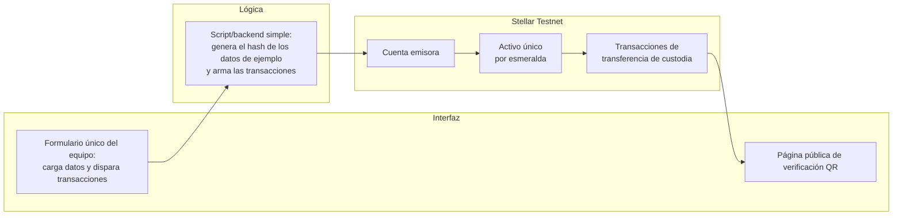

# Product Blueprint

**Nombre del proyecto:** GENUINA — Trazabilidad y autenticidad de la esmeralda colombiana

**Repositorio (enlace obligatorio):** [Blockchain_BB101COL](https://github.com/GioAgudelo/Blockchain_BB101COL)

---

## Contenido

1. Priorización de historias
2. Propuesta de valor
3. Flujo de usuario
4. Alcance del MVP
5. Lean Canvas
6. Backlog priorizado (Kanban)
7. Arquitectura inicial
8. Uso de Stellar y justificación

---

## 1. Priorización de historias

**Criterio de priorización:** Clasificamos cada historia en imprescindible / debería / podría / queda fuera según qué tan directo es su efecto sobre la fricción central que identificó el Problem Brief —el vínculo roto entre la piedra física y su certificado— y según si es viable construirla en las cinco semanas de desarrollo que tiene el equipo. Lo que ataca esa fricción de frente entra como imprescindible; lo que suma valor pero no es indispensable para probar el concepto queda para después.

| Prioridad | Historia | Propuesta por | Por qué entra al backlog |
| :---: | --- | :---: | --- |
| 1 (imprescindible) | Como técnico del laboratorio gemológico, quiero escanear el "jardín" interno de cada esmeralda y firmar digitalmente ese registro para emitir un certificado atado a la piedra física. | Giovanny Agudelo | Es el ancla de confianza de todo el sistema: sin este registro no hay nada verificable después. |
| 2 (imprescindible) | Como minero artesanal en Boyacá, quiero registrar desde mi celular el lugar y la fecha en que extraje una esmeralda para que esa información quede ligada a la piedra desde el primer momento. | Giovanny Agudelo | Ataca directamente la fricción de precio injusto del paso 2 del flujo actual; sin origen registrado no hay cadena de custodia real. |
| 3 (imprescindible) | Como comprador internacional, quiero escanear un código en la joya antes de pagarla y ver el recorrido completo de la gema. | Giovanny Agudelo | Es el punto donde el usuario final percibe el valor del producto; sin verificación visible, el sistema no demuestra nada. |
| 4 (debería) | Como orfebre que talla y engasta esmeraldas colombianas, quiero sumar mi proceso de trabajo al historial de la piedra. | Giovanny Agudelo | Completa la cadena de custodia, pero el MVP puede funcionar con una transferencia directa de laboratorio a comercializador si hace falta recortar tiempo. |
| 5 (podría) | Como comercializador legal de esmeraldas, quiero dejar constancia de que le compré la piedra a un minero con registro vigente ante las autoridades mineras. | Giovanny Agudelo | Aporta valor de cumplimiento legal, pero no es indispensable para demostrar el concepto central de trazabilidad. |

---

## 2. Propuesta de valor

**Usuario (del Problem Brief):** Los tres actores de la cadena de valor de la esmeralda colombiana: el minero artesanal de Boyacá (Muzo, Chivor, Coscuez), que hoy depende de intermediarios que pagan precios desproporcionadamente bajos por no poder certificar el origen ético de su trabajo; la diseñadora u orfebre local, que engasta esmeraldas colombianas pero enfrenta la desconfianza de compradores extranjeros sobre su autenticidad; y el comprador internacional, que busca la certeza de que su inversión es una gema 100% natural, de origen colombiano y libre de conflictos.

**Resultado que obtiene:** Cada esmeralda recibe un pasaporte digital inmutable (un activo único emitido en Stellar), generado a partir del escaneo de su "jardín" interno de inclusiones —una huella óptica irrepetible— junto con peso, corte, tono y claridad, firmados criptográficamente por el laboratorio gemológico. Desde la extracción hasta la joya terminada, cada actor de la cadena registra su paso, y el comprador final verifica todo el historial escaneando un código QR.

**Por qué elegiría esta solución:** Porque reemplaza la confianza ciega en un papel por una prueba verificable en segundos. El certificado deja de ser un documento que hay que creer y se convierte en un registro ligado matemáticamente a la piedra física, que ni el minero, ni la orfebre, ni el comprador tienen que defender con su palabra.

**En qué se diferencia de cómo lo resuelve hoy:** Hoy la autenticidad depende exclusivamente de certificados físicos impresos por laboratorios gemológicos, sin vínculo criptográfico con la gema: pueden clonarse, alterarse o presentarse junto a una piedra distinta. Validar una gema en laboratorios internacionales toma semanas de transporte, custodia y pólizas costosas, y el fraude resultante erosiona la reputación y el valor del producto colombiano en el mercado global.

---

## 3. Flujo de usuario

**Visión completa del producto** (los roles que debería tener el producto terminado):

| Paso | Rol | Qué hace | Punto de interacción |
| :---: | :---: | --- | --- |
| 1 | Laboratorio gemológico | Escanea el "jardín" óptico de la esmeralda y registra peso, corte, tono y claridad. | Panel web del laboratorio, firmado con su propia cuenta en Stellar. |
| 2 | Minero / asociación minera | Registra el lugar y la fecha de extracción, vinculado a la gema que acaba de salir del laboratorio. | Formulario web simple, firmado con su propia cuenta en Stellar. |
| 3 | Orfebre / taller | Suma su proceso de tallado y engaste al historial del activo. | Panel web del taller, firmado con su propia cuenta en Stellar. |
| 4 | Comercializador / joyería | Transfiere la custodia del activo al comprar o vender la pieza terminada. | Panel web, transacción de transferencia en Stellar. |
| 5 | Comprador internacional | Escanea el código QR de la joya y consulta el historial completo antes de pagar. | Página pública de verificación, sin necesidad de billetera propia. |

**Flujo real que va a construir el equipo en el tiempo que queda:**

1. El equipo carga los datos de una esmeralda de ejemplo (peso, corte, tono, claridad y un hash del "jardín" óptico) en un formulario único y emite el activo en Stellar Testnet.
2. El equipo simula, con el mismo formulario o un par de comandos, las transacciones de transferencia de custodia (minero → taller → comercializador), para dejar un historial real en la red.
3. Cualquier persona entra a la página pública, escanea el código QR o busca el identificador de la gema, y ve el historial real leído directamente de Stellar Testnet —esta es la única parte que debe funcionar sin intervención del equipo, porque es la que demuestra el concepto frente a quien evalúe el proyecto.

---

## 4. Alcance del MVP

| Dentro del MVP (lo que el equipo va a construir) | Fuera del MVP (visión del producto, no para este bootcamp) |
| --- | --- |
| Emisión de un activo en Stellar Testnet por gema, con datos básicos (peso, corte, tono, claridad y un hash de ejemplo del "jardín" óptico). | Escaneo real del "jardín" óptico de una gema física; el MVP usa datos de ejemplo cargados a mano. |
| Transacciones de transferencia de custodia simuladas por el equipo (minero → taller → comercializador), operadas desde una sola herramienta, sin necesidad de que cada actor tenga su propia cuenta funcionando. | Interfaces separadas por rol con login y firma independiente para laboratorio, minero, taller y comercializador. |
| Página pública de consulta: cualquiera puede ver el historial real de una gema leyendo directamente de Stellar Testnet. | Cuentas multi-firma, aplicación móvil, integración con RUCOM/ANM, reportes gerenciales, soporte multi-idioma. |

**Por qué el recorte sigue entregando valor:** aunque el equipo opere las transacciones a mano en vez de que cada actor tenga su propia interfaz, la pieza que importa —que una esmeralda tenga un registro inmutable en una red pública, y que cualquiera pueda verificarlo sin confiar en la palabra de nadie— queda genuinamente construida y funcionando en Stellar Testnet, no simulada. Eso es lo que hay que defender frente al equipo evaluador: no un producto terminado, sino la prueba de que el concepto central del Problem Brief funciona en una red real.

---

## 5. Lean Canvas

**Enlace al Lean Canvas:** [Lean Canvas de GENUINA](https://next.canvanizer.com/canvas/wtezaWmMTuopw)

## 6. Backlog priorizado (Kanban)

**Enlace al tablero:** ⚠️ Pendiente

---

## 7. Arquitectura inicial

**Diagrama (lo que el equipo va a construir en el MVP):**

| Capa | Componente | Qué hace |
| :---: | --- | --- |
| Interfaz | Un formulario único operado por el equipo (no por cada actor) para cargar los datos y disparar las transacciones, más la página pública de verificación, que sí es de uso abierto. | El formulario reemplaza, para el MVP, los paneles separados por rol; la página pública es la única pieza pensada para un usuario externo. |
| Lógica | Un script o backend simple. | Genera el hash de los datos de ejemplo de la gema y arma las transacciones que se envían a Stellar Testnet. No incluye autenticación por rol ni validaciones de producción. |
| Stellar Testnet | Cuenta emisora, activo único por gema, transacciones de transferencia de custodia. | Es el registro real: cada transacción queda firmada, pública e inalterable en la red de pruebas, aunque quien firme en el MVP sea el equipo y no cada actor por separado. |

**En qué punto entra la red:** entra en dos momentos reales, aunque operados por el equipo en el MVP: cuando se emite el activo (nace el pasaporte digital de la gema) y en cada transacción de transferencia de custodia que se registra después. La página pública no escribe en la red, solo lee el histórico directamente de Stellar Testnet, así que esa consulta sí es 100% real y verificable por cualquiera, sin pasar por una base de datos propia de GENUINA.

---

## 8. Uso de Stellar y justificación

**Criterio de pertinencia (del Problem Brief):** Varias partes que no confían entre sí (minero, laboratorio gemológico, orfebre, comercializador, comprador) necesitan compartir un mismo registro sin que ninguna lo controle unilateralmente, y el histórico de certificación no puede alterarse una vez emitido.

| Componente de Stellar | Para qué lo usamos | Por qué ese y no otra alternativa |
| --- | --- | --- |
| Activos nativos de Stellar (un asset único por esmeralda, cantidad fija = 1) | Representar el pasaporte digital de cada gema. | Stellar permite emitir activos de forma nativa, sin escribir ni auditar un contrato inteligente propio. Dado que el equipo tiene cinco semanas, evitar desplegar un contrato NFT desde cero en una L2/EVM reduce el riesgo técnico del proyecto. |
| Cuentas multi-firma, para la cuenta emisora del laboratorio | Evitar que una sola persona del laboratorio pueda emitir un certificado falso por su cuenta. | La multi-firma es nativa del protocolo de Stellar; no hace falta programar lógica adicional para exigir más de una firma en la emisión. |
| Tarifas de red bajas y confirmación en segundos | Que cada actor —incluido el minero, el eslabón con menos recursos— pueda registrar su paso sin que el costo de transacción sea una barrera. | Resuelve directamente la necesidad de "tarifas insignificantes" de la propuesta original sin añadir una capa 2 o rollup aparte, que sería infraestructura extra que mantener dentro del MVP. |

